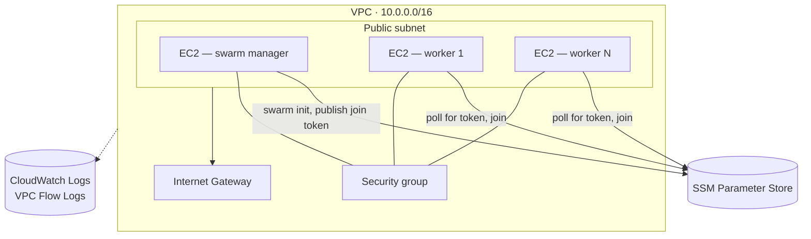

# docker-swarm-terraform

[](https://github.com/JhonZuluaga007/docker-swarm-terraform/actions/workflows/terraform-ci.yml)
[](LICENSE)

Terraform that stands up a real Docker Swarm cluster on AWS: one manager, N workers, and everything they need to actually find each other and join a cluster on boot — no manual SSH step, no copy-pasting join tokens.

## What it builds

- A VPC with a public subnet, an internet gateway, and VPC Flow Logs.
- A security group scoped to what the cluster actually needs: SSH from CIDRs you specify, swarm control-plane and overlay ports open only between cluster members, HTTP/HTTPS closed unless you turn them on.
- One manager and `worker_count` worker EC2 instances, each with its own IAM role.
- A bootstrap flow where the manager publishes its join token to SSM Parameter Store and workers poll for it, instead of a Terraform provisioner reaching in over SSH.



Three modules, called from the root module in order: `networking` → `security` → `compute`. Each has its own README with a full variables/outputs reference — see `modules/networking`, `modules/security`, `modules/compute`.

## Prerequisites

- Terraform >= 1.5.0
- An AWS account and credentials available to the AWS provider (env vars, `~/.aws/credentials`, or an assumed role — this repo never reads or stores credentials itself)
- An existing EC2 key pair in the target region (Terraform doesn't create one — see "Design decisions" for why)

## Quick start

```bash
cp terraform.tfvars.example terraform.tfvars
# edit terraform.tfvars: set key_name and ssh_allowed_cidr_blocks at minimum

terraform init
terraform apply
```

`ssh_allowed_cidr_blocks` has no default on purpose — you have to decide who can reach port 22. Something like `["203.0.113.10/32"]` (your own IP) is the right call for a demo; never `0.0.0.0/0` unless you also set `allow_ssh_from_anywhere = true`, which is a deliberate second step, not an accident.

This uses local state. See "Remote backend and environments" below if you want S3 + DynamoDB and a dev/staging/prod split instead.

## Verifying the cluster

Give the instances a couple of minutes to finish their boot scripts, then:

```bash
terraform output verify_swarm_command
```

That prints an SSH command that runs `docker node ls` on the manager. You should see one manager and `worker_count` workers, all `Ready`. If a worker isn't there yet, it's probably still polling SSM for the join token — `user_data.sh.tpl` retries for up to five minutes before giving up.

## Remote backend and environments

By default this repo uses local Terraform state. If you want shared state with locking, or a dev/staging/prod split, there's an opt-in path:

1. Create the S3 bucket and DynamoDB table once, from the standalone `bootstrap/` stack:

   ```bash
   cd bootstrap
   terraform init
   terraform apply -var="state_bucket_name=<a-globally-unique-name>"
   ```

2. Fill in `environments/dev.backend.hcl` with the bucket/table names from the outputs above.

3. Back in the repo root:

   ```bash
   terraform init -backend-config=environments/dev.backend.hcl
   cp environments/dev.tfvars.example environments/dev.tfvars
   # edit environments/dev.tfvars with your real values
   terraform apply -var-file=environments/dev.tfvars
   ```

`staging` and `prod` follow the same pattern with their own `.backend.hcl` / `.tfvars.example` pair. Both the backend configs and the tfvars examples are checked in — only the real, filled-in `*.tfvars` files are gitignored, the same way you'd handle `.env` vs `.env.example`.

## Design decisions

A few choices here aren't the "obvious" ones, so it's worth explaining why.

**SSM Parameter Store instead of a `remote-exec` provisioner.** The easy way to bootstrap a swarm from Terraform is a provisioner that SSHes in and runs `docker swarm join`. I didn't do that — provisioners need Terraform itself to have live SSH access at `apply` time, they're not idempotent, and they don't recover if an instance gets replaced outside of an `apply`. Publishing the join token to SSM and having each worker poll for it means the bootstrap logic lives entirely in `user_data`, works the same way whether Terraform is watching or not, and never needs an open SSH path from wherever `terraform apply` happens to run.

**AMI resolved through an SSM public parameter, not `most_recent = true`.** `most_recent` means the AMI silently changes between two `plan` runs a week apart. Reading `/aws/service/ami-amazon-linux-latest/...` is the same non-pinned behavior AWS itself recommends, and it's overridable via `ami_id` if you want a fixed image.

**The security group's egress is wide open, and that's staying that way for now.** Workers need to reach Docker Hub, the Amazon Linux package repos, and the SSM API, all of which live on IP ranges that change and aren't practical to allowlist by CIDR. Locking this down properly means VPC endpoints for SSM/S3 and an egress firewall for everything else — real work, tracked in the roadmap below, not something I'm going to fake with a CIDR list that doesn't actually restrict anything.

**No NAT gateway, so the subnet is public.** The instances need outbound internet access (SSM, package installs, Docker Hub) and there's no NAT gateway in this setup, so they get public IPs directly. A NAT gateway runs about $32/month before any data charges — real money for a repo meant to be applied for a demo and torn back down. Private subnets are on the roadmap for anyone who wants to run this as more than a demo.

**`t3.micro` over `t2.micro`.** `t2` instances can't be EBS-optimized, which was a hard blocker for a checkov finding I wasn't willing to just skip. `t3` is Nitro-based, EBS-optimized by default, and free-tier eligible on most accounts, so it was a straightforward swap.

**No customer-managed KMS key for the DynamoDB lock table.** The table only ever holds a lock ID, not the state content itself (that's in S3, which is KMS-encrypted). A dedicated CMK for a table that stores nothing sensitive felt like cost and complexity without a real benefit, so that finding is documented as an accepted trade-off instead of "fixed."

Every checkov finding that isn't fixed in the code is skipped with an inline `#checkov:skip=<ID>:<reason>` comment on the resource it applies to — search the codebase for `checkov:skip` to see all of them with their justification in place, rather than a bare exception list somewhere.

## Cost

Rough numbers for `us-east-1`, on-demand pricing — check the [AWS pricing page](https://aws.amazon.com/ec2/pricing/on-demand/) for current rates:

| Item | Approx. cost |
|---|---|
| 3x `t3.micro` (1 manager + 2 workers) | ~$0.03/hour combined |
| 3x 30 GB gp2 EBS volumes | ~$9/month if left running |
| DynamoDB (pay-per-request), S3 state storage | a few cents/month |
| CloudWatch Logs (VPC Flow Logs, 365-day retention) | a few cents to a couple dollars/month, depending on traffic |

Left running continuously this lands somewhere around $30–35/month, dominated by EBS and compute. Applied, verified, and destroyed within an hour or two — which is how this is meant to be used — it costs well under a dollar.

## Cleanup

```bash
terraform destroy
```

If you're using the remote backend, that only tears down the cluster, not the state bucket/lock table — destroy those separately from `bootstrap/` if you're done with them entirely:

```bash
cd bootstrap
terraform destroy -var="state_bucket_name=<the-name-you-used>"
```

## Roadmap

Not implemented here, and deliberately so — each of these adds real cost or real complexity that doesn't belong in a demo-sized default:

- **Application Load Balancer** in front of the swarm's routing mesh, so HTTP/HTTPS traffic doesn't depend on which node happens to answer.
- **Private subnets + NAT gateway + multi-AZ.** Right now everything is one public subnet in one AZ — fine for a demo, not fine for anything that needs to survive an AZ outage.
- **Auto Scaling Group for workers**, with lifecycle hooks that run `docker swarm join` on scale-out and `docker node rm --force` on scale-in, instead of a fixed `worker_count`.
- **CloudWatch dashboard and alarms** built on top of the flow logs and Docker daemon metrics that are already being collected but not yet visualized.

## Repository layout

```
.
├── main.tf, variables.tf, outputs.tf, versions.tf, backend.tf   # root module
├── modules/
│   ├── networking/     # VPC, subnet, IGW, flow logs
│   ├── security/       # the cluster's security group
│   └── compute/        # manager/worker instances, IAM roles, swarm bootstrap
├── bootstrap/           # one-time stack: S3 + DynamoDB for remote state
├── environments/        # per-environment backend configs and tfvars examples
└── .github/workflows/   # CI: fmt, validate, tflint, checkov, gitleaks
```

## Reference

<!-- BEGIN_TF_DOCS -->
## Requirements

| Name | Version |
|------|---------|
| <a name="requirement_terraform"></a> [terraform](#requirement\_terraform) | >= 1.5.0 |
| <a name="requirement_aws"></a> [aws](#requirement\_aws) | ~> 5.0 |

## Providers

No providers.

## Modules

| Name | Source | Version |
|------|--------|---------|
| <a name="module_compute"></a> [compute](#module\_compute) | ./modules/compute | n/a |
| <a name="module_networking"></a> [networking](#module\_networking) | ./modules/networking | n/a |
| <a name="module_security"></a> [security](#module\_security) | ./modules/security | n/a |

## Resources

No resources.

## Inputs

| Name | Description | Type | Default | Required |
|------|-------------|------|---------|:--------:|
| <a name="input_allow_ssh_from_anywhere"></a> [allow\_ssh\_from\_anywhere](#input\_allow\_ssh\_from\_anywhere) | Explicit opt-in required to allow ssh\_allowed\_cidr\_blocks to include 0.0.0.0/0. | `bool` | `false` | no |
| <a name="input_aws_region"></a> [aws\_region](#input\_aws\_region) | AWS region to deploy resources | `string` | `"us-east-1"` | no |
| <a name="input_enable_web_ingress"></a> [enable\_web\_ingress](#input\_enable\_web\_ingress) | Whether to open ports 80/443 on the security group, e.g. to expose a demo service through the swarm routing mesh. | `bool` | `false` | no |
| <a name="input_environment"></a> [environment](#input\_environment) | Environment name | `string` | `"dev"` | no |
| <a name="input_instance_type"></a> [instance\_type](#input\_instance\_type) | Instance type for the EC2 instances. Defaults to a Nitro-based instance (EBS-optimized by default, supports IMDSv2 natively). | `string` | `"t3.micro"` | no |
| <a name="input_key_name"></a> [key\_name](#input\_key\_name) | Name of the AWS key pair to use for instances | `string` | n/a | yes |
| <a name="input_project_name"></a> [project\_name](#input\_project\_name) | Project name to be used for tagging | `string` | `"docker-swarm"` | no |
| <a name="input_ssh_allowed_cidr_blocks"></a> [ssh\_allowed\_cidr\_blocks](#input\_ssh\_allowed\_cidr\_blocks) | CIDR blocks allowed to reach SSH (port 22). No public default — must be set explicitly (e.g. ["<your-ip>/32"]). | `list(string)` | n/a | yes |
| <a name="input_worker_count"></a> [worker\_count](#input\_worker\_count) | Number of Docker Swarm worker nodes to create | `number` | `2` | no |

## Outputs

| Name | Description |
|------|-------------|
| <a name="output_manager_public_ip"></a> [manager\_public\_ip](#output\_manager\_public\_ip) | Public IP of the Swarm manager node |
| <a name="output_security_group_id"></a> [security\_group\_id](#output\_security\_group\_id) | ID of the created security group |
| <a name="output_verify_swarm_command"></a> [verify\_swarm\_command](#output\_verify\_swarm\_command) | Command to verify the Docker Swarm cluster once the instances have finished bootstrapping (allow 2-3 minutes after apply) |
| <a name="output_vpc_id"></a> [vpc\_id](#output\_vpc\_id) | ID of the created VPC |
| <a name="output_worker_public_ips"></a> [worker\_public\_ips](#output\_worker\_public\_ips) | Public IPs of the Swarm worker nodes |
<!-- END_TF_DOCS -->

## License

MIT — see [LICENSE](LICENSE).
